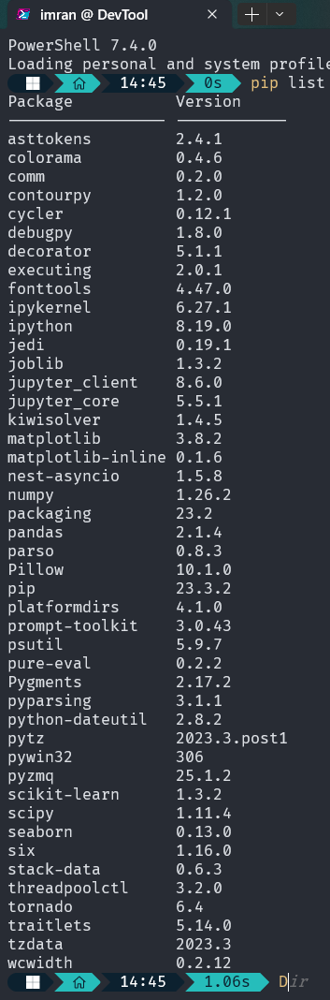

# Traffic Prediction Project

## Overview

This project focuses on predicting traffic volume using machine learning techniques. The goal is to develop accurate models for traffic prediction at different junctions.

## Key Features

- Data preprocessing and feature engineering
- Training and evaluation of classification models
- Visualizations for model performance

## Getting Started

To get started with the project, you can clone the repository:

# bash

git clone https://github.com/ImranParthibInsights/Traffic_Prediction_Using_Machine_Learning.git

# Prerequisites

Make sure you have the following dependencies installed:

Python 3.x
Required Python packages(listed in 'requirements.txt')

# Usage

Navigate to the project directory or go to terminal and paste this:
pip install -r requirements.txt

# How to Contribute

If you're interested in contributing to the project, you can:

Fork the repository.
Make your changes and enhancements.
Submit a pull request.

# Collaborate

If you're interested in collaborating on this project or have suggestions, feel free to open an issue or reach out. Your insights are highly valued!

# Repository Link

The project is hosted on GitHub. You can find it at:

https://github.com/ImranParthibInsights/Traffic_Prediction_Using_Machine_Learning

# Ideas to Improve Our Traffic Prediction Script 🚀

Hey there! 👋 I've been thinking about how we can make our traffic prediction script even cooler and beginner-friendly. Here are some friendly suggestions:

1.Keeping Things Fair with Data Splitting:
What if we ensure that our models play with the same set of cards? Moving the data splitting process outside the loop can help each model get a fair share of training and testing data. It's like giving everyone an equal chance to shine!

2. Making Our MLP Model Smarter:
   Let's help our MLP model be a bit more efficient by defining it outside the loop. This small tweak is like giving it a little extra brainpower.

3.Clearer Pictures with Subplots:
Imagine telling a story with pictures—subplots for each junction and model could make our visualizations super easy to follow. It's like creating a comic strip of our model's adventures in predicting traffic!

4.Adding More Friends to the Evaluation Party:
Beyond just checking for mistakes, let's invite more friends to the evaluation party. Accuracy, precision, and recall can join the MAE in giving us a complete picture of how our models are doing. It's like having a team of superheroes instead of just one!

#LICENSE

([MIT License](LICENSE))
